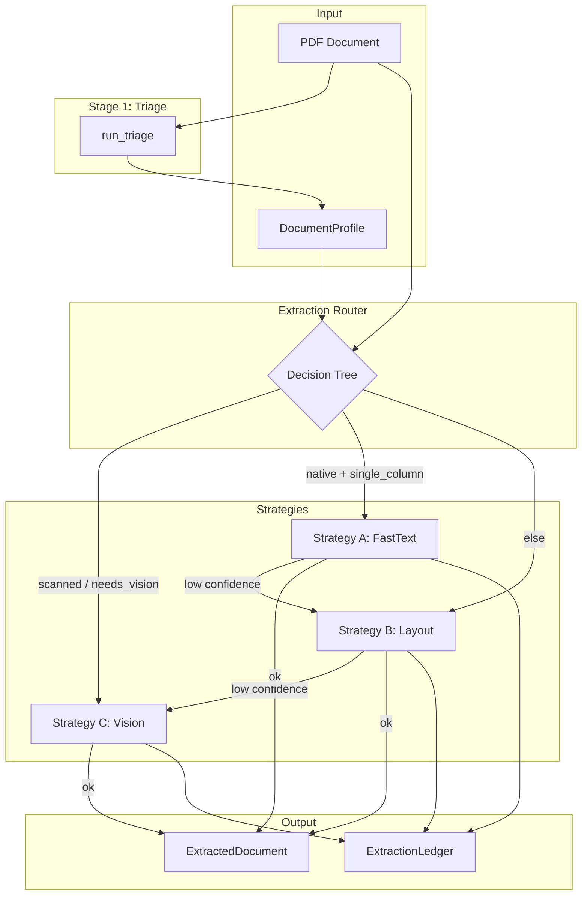
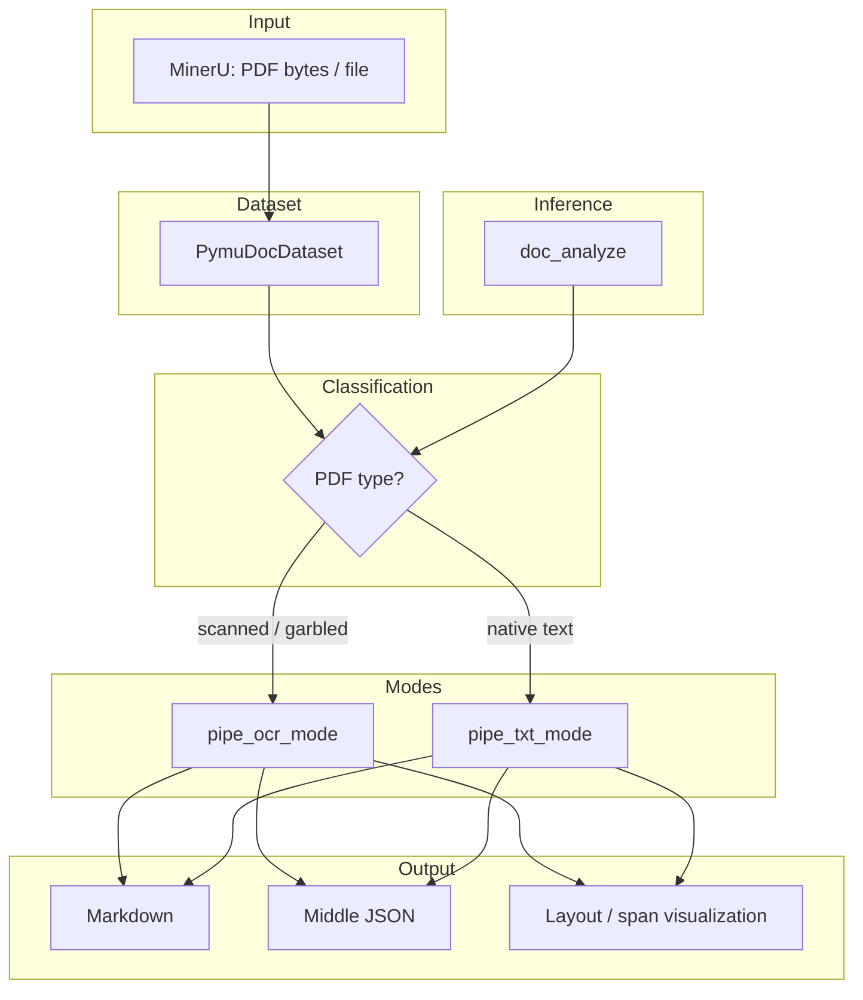

# Domain Notes

Document Intelligence Refinery: extraction strategy decision tree, failure modes, pipeline diagrams, and analysis instructions.

---

## 1. Extraction Strategy Decision Tree

The Extraction Router selects strategy from DocumentProfile and escalates on low confidence:

```
                    ┌─────────────────────────────────────────────────────┐
                    │                  DocumentProfile                     │
                    │  origin_type, layout_complexity,                     │
                    │  estimated_extraction_cost                           │
                    └─────────────────────────────────────────────────────┘
                                        │
                                        ▼
        ┌───────────────────────────────────────────────────────────────────┐
        │  origin_type = scanned_image  OR  needs_vision_model?              │
        └───────────────────────────────────────────────────────────────────┘
                    │ YES                                    │ NO
                    ▼                                        ▼
        ┌───────────────────────┐              ┌─────────────────────────────────────┐
        │  Strategy C (Vision)  │              │  native_digital AND single_column?   │
        │  Start here only      │              └─────────────────────────────────────┘
        └───────────────────────┘                    │ YES              │ NO
                                                     ▼                  ▼
                                        ┌───────────────────┐  ┌───────────────────────┐
                                        │ Strategy A first  │  │ Strategy B (Layout)   │
                                        │ (FastText)        │  │ Start here directly   │
                                        └───────────────────┘  └───────────────────────┘
                                                     │
                                                     ▼
                                        ┌───────────────────┐
                                        │ confidence ≥ threshold? │
                                        └───────────────────┘
                                         │ YES        │ NO
                                         ▼            ▼
                                    [EMIT A]    [ESCALATE to B]
                                                     │
                                                     ▼
                                        ┌───────────────────┐
                                        │ Strategy B used   │
                                        │ confidence ≥ threshold? │
                                        └───────────────────┘
                                         │ YES        │ NO
                                         ▼            ▼
                                    [EMIT B]    [ESCALATE to C]
                                                     │
                                                     ▼
                                        ┌───────────────────┐
                                        │ Strategy C (Vision)│
                                        │ succeed? → EMIT C  │
                                        │ fail? → escalation_failed │
                                        └───────────────────────┘
```

**Summary rules (Spec 03 §7.1):**

| Condition | Action |
|-----------|--------|
| `scanned_image` or `needs_vision_model` | Strategy C only |
| `native_digital` + `single_column` | Try A → if low confidence, escalate to B |
| `multi_column`, `table_heavy`, `figure_heavy`, `mixed` | Strategy B directly |
| B used and low confidence | Escalate to C |
| C fails (budget, API error) | `escalation_failed`; no ExtractedDocument |

---

## 2. Failure Modes Observed

| Failure mode | Description | Required behavior |
|--------------|-------------|-------------------|
| **Strategy A confidence low** | Fast text unsuitable (low char density, high image ratio, etc.). | Escalate to B; do not emit A output. Log. |
| **Strategy B confidence low** | Layout extraction weak. | Escalate to C; do not emit B output. Log. |
| **Strategy C budget cap exceeded** | Document would exceed cost cap. | Halt C; log `budget_exceeded`; emit error or partial result with flag. |
| **Strategy C API failure** | VLM unavailable, timeout, rate limit. | Retry per policy; if exhausted, fail with clear error. Do not emit fake ExtractedDocument. |
| **All strategies exhausted** | A → B → C all failed. | Emit failure (no ExtractedDocument); log full escalation path. |
| **Corrupt or unreadable document** | PDF cannot be parsed. | Fail early; log; no ExtractedDocument. |
| **Partial success** | Some pages extracted, others failed (e.g. budget cap mid-document). | Flag `partial=true`, `pages_missing=[...]`; ledger records partial status. |
| **Docling / MinerU not installed** | Layout backend (docling or mineru) not available. | Return `notes="backend docling not installed"` or equivalent. |
| **Vision API not configured** | No API key or provider library missing. | Return `notes="vision_api_not_configured"`; do not emit ExtractedDocument. |
| **OCR stall on scanned PDFs** | Docling/RapidOCR very slow on CPU for large scans. | Mitigate with `--max-pages`, GPU if available, log suppression. |

---

## 3. Pipeline Diagrams

### 3.1 Document Intelligence Refinery — Extraction Pipeline



### 3.2 MinerU — Architecture Pipeline

MinerU converts PDFs to machine-readable formats (Markdown, JSON) via a modular pipeline. Read [MinerU docs](https://opendatalab.github.io/MinerU/) end-to-end; sketch the flow on paper first. Below is a Mermaid version for reference.



**MinerU key stages (high level):**

1. **Dataset** — Load PDF into `PymuDocDataset`
2. **Classification** — `SupportedPdfParseMethod` → decide OCR vs text mode
3. **Model inference** — `doc_analyze` (layout, tables, formulas, OCR)
4. **Pipeline** — `pipe_ocr_mode()` or `pipe_txt_mode()` depending on PDF type
5. **Export** — Markdown, JSON (reading-order sorted), content list, visualizations

---

## 4. Character Density Analysis & Docling Comparison

### Run character density analysis

Uses pdfplumber to report character density, bbox distributions, and whitespace ratios:

```bash
uv run python scripts/run_character_density_analysis.py path/to/document.pdf
```

Optional: write full JSON with `-o report.json`.

**Observe:**

- **Character density** (chars per 10k points²): higher for text-heavy pages, lower for scanned or image-heavy
- **Whitespace ratio**: high for sparse layouts, low for dense text
- **Bbox distribution** (width/height): narrow spread → uniform layout; wide spread → mixed content

### Run Docling

```bash
uv run python scripts/run_docling.py path/to/document.pdf -o outputs/docling/
```

Requires `uv sync --extra docling`. Use `-n 5` to limit pages for faster runs on large scans.

### Compare output quality

| Document type | Character density (pdfplumber) | Docling behavior |
|---------------|-------------------------------|------------------|
| Native digital, text-heavy | High density, low whitespace | Good text extraction; tables as HTML |
| Scanned image | Low density, high whitespace | OCR via RapidOCR; slower on CPU |
| Mixed (text + images) | Medium density | Layout-aware; preserves structure |
| Multi-column | Bbox spread varies | Reading-order preserved in Markdown/JSON |

**Failures observed:**

- Scanned PDFs: Docling can stall on CPU; use `-n` or GPU when possible.
- MinerU: adapter in this repo is a stub; use Docling for layout extraction.
