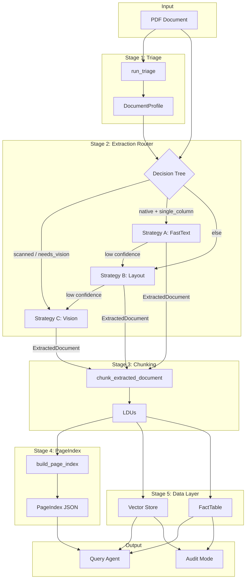
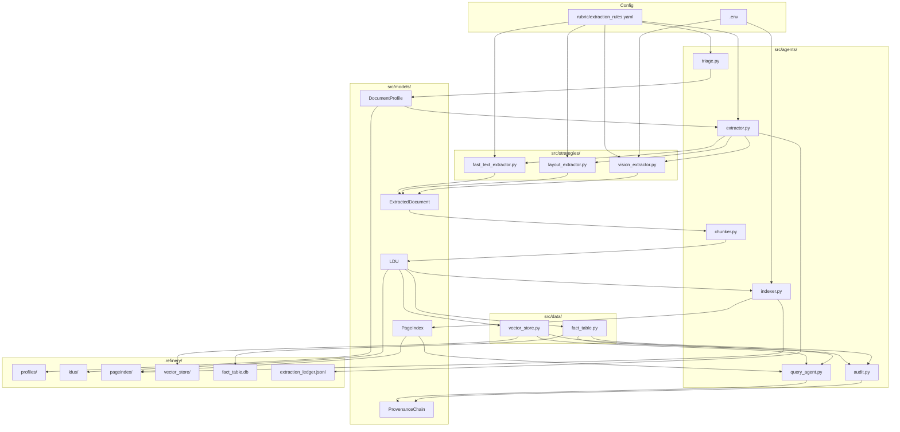

# Document Intelligence Refinery — Technical Report

A single consolidated report covering domain notes, extraction strategy routing, failure modes, architecture, cost analysis, extraction quality, and lessons learned.

---

## 1. Domain Notes

Domain hints are derived from keyword scoring over sampled text (first 5 pages). Configuration lives in `rubric/extraction_rules.yaml`.

### Domain classifier

| Domain    | Keywords                                                                                       |
|-----------|-----------------------------------------------------------------------------------------------|
| **financial** | revenue, balance sheet, fiscal, audit, expenditure, profit, assets, liabilities              |
| **legal**     | whereas, hereby, clause, agreement, court, plaintiff, defendant, pursuant                     |
| **technical** | implementation, assessment, methodology, findings, specification, architecture, deployment   |
| **medical**   | patient, diagnosis, treatment, clinical, medication, therapy, symptoms                        |

### Scoring logic

- **Score:** `min(1.0, hits / max(1, len(terms)//2))`
- **Confidence cutoff:** 0.3
- Domain is assigned only if `score ≥ confidence_cutoff` and `hits > 0`; otherwise `general`.

### Reference document classes (Spec 01)

| Class | Description | Expected triage output |
|-------|-------------|------------------------|
| **A** | Annual financial report (native digital, multi-column, tables) | `native_digital`/`mixed`, `multi_column`/`table_heavy`, `financial` |
| **B** | Scanned government/legal (image-based PDF) | `scanned_image`, `needs_vision_model` |
| **C** | Technical assessment (mixed text, tables, sections) | `native_digital`/`mixed`, `multi_column`/`mixed`, `technical` |
| **D** | Structured data report (table-heavy, numerical) | `native_digital`/`mixed`, `table_heavy`, `financial`/`general` |

---

## 2. Extraction Strategy Decision Tree

The router (`_initial_strategy_chain` in `src/agents/extractor.py`) selects an ordered list of strategies from `DocumentProfile`:

```
IF origin_type = scanned_image  OR  estimated_extraction_cost = needs_vision_model
   → chain = [vision, layout]     (Strategy C first; layout fallback when vision unavailable)

ELIF origin_type = native_digital  AND  layout_complexity = single_column
   → chain = [fast_text, layout, vision]   (Try A → B → C on low confidence)

ELSE  (multi_column, table_heavy, figure_heavy, mixed)
   → chain = [layout, vision]     (Strategy B first)
```

### Escalation rules

| Condition | Action |
|-----------|--------|
| Strategy A confidence < 0.5 | Escalate to B; do **not** emit A output |
| Strategy B confidence < 0.5 | Escalate to C; do **not** emit B output |
| Strategy C fails (API, budget, pymupdf missing) | `escalation_failed`; no ExtractedDocument |

Thresholds are configurable in `rubric/extraction_rules.yaml` (`router.fast_text_confidence_threshold`, `router.layout_confidence_threshold`).

### Cost derivation (Spec 02, `derive_estimated_extraction_cost`)

| origin_type     | layout_complexity | estimated_extraction_cost |
|-----------------|-------------------|---------------------------|
| scanned_image   | any               | needs_vision_model        |
| native_digital  | single_column     | fast_text_sufficient      |
| native_digital  | table_heavy, multi_column | needs_layout_model |
| mixed           | any               | needs_layout_model or needs_vision_model |

---

## 3. Failure Modes Observed Across Document Types

### 3.1 Triage (Stage 1)

| Failure mode | Description | Document type | Required behavior |
|--------------|-------------|---------------|-------------------|
| Ambiguous classification | Conflicting signals (e.g. mixed origin + mixed layout) | Mixed layouts, scanned+digital hybrid | Emit single classification; low `triage_confidence_score`; optional `notes` |
| Zero-page document | Empty or unparseable PDF | Corrupt, password-protected | Fail; no DocumentProfile |
| Unreadable file | IO error, invalid format | Corrupt, non-PDF | Fail early; no DocumentProfile |

### 3.2 Extraction (Stage 2)

| Failure mode | Description | Document type | Behavior |
|--------------|-------------|---------------|----------|
| **Strategy A low confidence** | Low char density, high image ratio, &lt;50 chars/page | Image-heavy native PDFs, sparse layouts | Escalate to B; do not emit A output; log `confidence_below_threshold` |
| **Strategy B low confidence** | Layout extraction weak (Docling/RapidOCR poor output) | Scanned multi-column, complex tables | Escalate to C; do not emit B output |
| **Strategy C budget exceeded** | Per-document cost cap exceeded | Large scanned docs, many pages | Halt C; log `budget_exceeded`; emit error or partial with `partial=true` |
| **Strategy C API failure** | VLM timeout, rate limit, provider error | Any | Retry per policy; fail with clear error; no fake ExtractedDocument |
| **Vision API not configured** | No API key, provider library missing | Scanned docs routed to C | Return `notes="vision_api_not_configured"`; no ExtractedDocument |
| **Docling/MinerU not installed** | Layout backend unavailable | Docs routed to B | Return `notes="backend docling not installed"` |
| **OCR stall on scanned PDFs** | Docling/RapidOCR very slow on CPU | Large scanned PDFs (e.g. 50+ pages) | Mitigate with `-n` (max pages), GPU if available; log suppression |
| **Corrupt/unreadable PDF** | PDF parse error | Corrupt, password-protected | Fail early; no ExtractedDocument |
| **Partial success** | Budget cap mid-document, some pages failed | Large docs with cap | Flag `partial=true`, `pages_missing=[...]`; ledger records partial status |
| **All strategies exhausted** | A→B→C all failed | Worst-case: scanned + no vision + weak layout | Emit failure; log full escalation path; downstream skips chunking |

### 3.3 Document-type-specific failure patterns

| Document type | Typical failure | Root cause | Mitigation |
|---------------|-----------------|------------|------------|
| **Native digital, single-column** | False escalation from A to B | Low char density on cover/title pages | Sample more pages; raise `min_chars_per_page` or tune confidence |
| **Annual financial report** | Table extraction poor (merged cells, wrong headers) | Layout extractor (Docling) misdetects table structure | Use `export_to_dataframe`; validate table shape; escalate to vision for critical tables |
| **Scanned government/legal** | OCR stall, timeout | RapidOCR/Tesseract CPU-bound on large scans | `--max-pages`, GPU, Tesseract (lighter than RapidOCR) |
| **Technical assessment (mixed)** | Reading order wrong | Multi-column + figures; Docling order heuristic fails | Fallback: bbox-based ordering (top→bottom, left→right) |
| **Table-heavy numerical report** | FactTable misses values | Regex/key-value extractor misses complex table layouts | Broaden fact extraction; include table LDUs in fact extraction |
| **Image-heavy PDFs** | Strategy A selected then escalated | High `image_area_ratio` not detected early | Origin/layout signals; ensure `max_image_area_ratio_digital` respected |

---

## 4. Pipeline Diagram (Mermaid)



---

## 5. Architecture Diagram



---

## 6. Full 5-Stage Pipeline with Strategy Routing Logic

### Stage 1: Triage

- **Input:** PDF path  
- **Output:** `DocumentProfile` (document_id, origin_type, layout_complexity, domain_hint, estimated_extraction_cost, triage_confidence_score, page_count)  
- **Logic:** Extract signals (chars/page, image ratio, table regions, columns); classify origin, layout, domain; derive cost tier.

### Stage 2: Extraction

- **Input:** PDF path, DocumentProfile  
- **Output:** ExtractedDocument or None; ExtractionLedgerEntry  
- **Routing:**
  1. If `scanned_image` or `needs_vision_model` → [vision, layout]
  2. Else if `native_digital` and `single_column` → [fast_text, layout, vision]
  3. Else → [layout, vision]
- **Escalation:** For each strategy, if `confidence_score >= threshold`, emit; else escalate. Never pass low-confidence output downstream.

### Stage 3: Chunking

- **Input:** ExtractedDocument  
- **Output:** List[LDU] (paragraph, table, list, figure, etc.)  
- **Logic:** Structure-respecting chunking; no table-cell splits; headers with tables; figures with captions; reading order preserved.

### Stage 4: PageIndex

- **Input:** LDUs, document_id, page_count, optional summarizer  
- **Output:** PageIndex tree (sections, page ranges, summaries, ldu_ids)  
- **Logic:** Build section hierarchy; optional LLM summaries per section (when REFINERY_VISION_PROVIDER set).

### Stage 5: Data Layer

- **Input:** LDUs  
- **Output:** Vector store (ChromaDB), FactTable (SQLite)  
- **Logic:** Embed LDUs; upsert to ChromaDB; extract facts (entity, metric, value, period) into SQLite.

---

## 7. Cost Analysis

### 7.1 Strategy tier cost model

| Strategy | API cost | Processing cost | Notes |
|----------|----------|-----------------|-------|
| **A (fast_text)** | $0 | CPU only (pdfplumber) | Negligible; no external calls |
| **B (layout)** | $0 | CPU (Docling/RapidOCR) | Local; may be slow on large scans |
| **C (vision)** | VLM API | CPU (render pages) + API latency | Dominated by token spend |

### 7.2 Token-based cost (Strategy C)

- **Model:** gpt-4o-mini (configurable)
- **Typical pricing (2024):** ~$0.15/1M input, ~$0.60/1M output
- **Vision note:** Vision tokens often billed at higher effective rate; images can inflate input tokens (reported ~25–33× vs text)
- **Ledger:** `token_usage_prompt`, `token_usage_completion`, `cost_estimate_usd` (caller can implement `record_usage`)

### 7.3 Processing time (multi-dimensional cost)

The extraction ledger records `processing_time_ms` per run. Approximate ranges:

| Strategy | Typical processing time | Notes |
|----------|-------------------------|-------|
| **A** | 0.5–5 s | Depends on page count; pdfplumber text extraction |
| **B** | 5–120+ s | Docling layout + optional OCR; scales with pages and scan quality |
| **C** | 10–60+ s | Page rendering + API; scales with `max_pages_per_document` (default 50) |

**Total pipeline (5 stages):**  
Triage (~1–3 s) + Extraction (strategy-dependent) + Chunking (~1–5 s) + PageIndex (~5–30 s with LLM) + Ingestion (~2–10 s) ≈ **20 s–3+ min** for typical documents.

---

## 8. Estimated Cost per Document by Strategy Tier

| Tier | Strategy | Est. API cost | Est. processing time | When used |
|------|----------|---------------|----------------------|-----------|
| **A** | fast_text | $0 | ~1–5 s | Native digital, single-column, high confidence |
| **B** | layout | $0 | ~5–120 s | Multi-column, table-heavy, figure-heavy, or A escalated |
| **C** | vision | ~$0.01–0.50+ per doc | ~10–60+ s | Scanned, or B escalated; cost scales with pages |

**Order-of-magnitude C cost (10 pages, gpt-4o-mini):**  
~500–2000 input tokens/page (vision-inflated) + ~500–2000 output → ~$0.02–0.10 per 10-page doc.  
50-page cap → ~$0.10–0.50 per doc for large scans.

---

## 9. Extraction Quality Analysis

### 9.1 Empirical extraction metrics (document `95b06e93627aab6fcdfb83214bda2acd`)

The following metrics are derived from a real pipeline run on the *Import Tax Expenditure Report: FY 2018/19–2020/21* (Ethiopia Ministry of Finance, 60-page native digital PDF).

| Metric | Value |
|--------|-------|
| **Document** | 60 pages, native_digital, multi_column, financial |
| **Strategy used** | layout (no escalation) |
| **Confidence score** | 0.75 |
| **Processing time** | 466 s (~7.8 min) |
| **Total LDUs** | 689 |
| **LDU breakdown** | 623 paragraph, 29 table, 15 heading, 6 list, 16 other |
| **Token count** | 19,553 |
| **FactTable rows** | 2,962 |
| **API cost** | $0 (Strategy B) |

**Interpretation:** Layout strategy handled multi-column + table-heavy content without escalation. High LDU and fact counts indicate strong structure preservation. No ground-truth corpus exists for precision/recall; these counts serve as throughput/coverage proxies.

### 9.2 Side-by-side extraction examples

**Good extraction (numerical table):** Docling correctly extracts a multi-year commodity breakdown:

| Expected structure | Extracted LDU (raw_payload) |
|-------------------|-----------------------------|
| Header: commodity, FY columns | `header: ["", "2018/19", "2019/20", "2020/21"]` |
| Rows: Animal products, Vegetable products, … | `rows: [["Animal products", "134.01", "139.41", "298.65"], ["Vegetable products", "749.10", "704.77", "1,592.27"], ...]` |

**Degraded extraction (complex / merged-cell table):** Layout extractor misinterprets structure, producing garbage in cells:

| Expected structure | Extracted LDU (raw_payload) |
|-------------------|-----------------------------|
| Header: benchmark source, FY columns | `header: ["", "2018/19", "2019/20", "2020/21"]` |
| Row: "This report" / "eCMS only" / "ECC standard rates" | `rows: [["This", "99.3", "78.3", "report 120.7"], ["This eCMS only", "68.7", "76.4", "report, 120.7"], ["Ministry of (2020)", "73.9", "", "Finance"], ...]` |

Text from adjacent cells is merged into single cells (e.g. `"report 120.7"`, `"Finance"`); semantic intent is lost. This matches Spec 04 §9.1: noisy table output → best-effort LDU; no vision fallback was attempted for this table.

### 9.3 Target metrics vs. implementation status (Spec 01 §8)

| Target metric | Definition | Implementation |
|---------------|------------|----------------|
| **Precision** | Correct cells / total extracted cells | Not implemented (no ground truth) |
| **Recall** | Correct cells / total ground-truth cells | Not implemented (no ground truth) |
| **Answer correctness** | Query answers with correct provenance | Audit mode verifies claims; no automated correctness suite |

**Current assessment:** Manual inspection of LDUs and FactTable; extraction ledger and confidence gates; audit-mode claim verification.

### 9.4 Quality factors

| Factor | Impact |
|--------|--------|
| **Strategy choice** | Vision generally higher fidelity for scans; layout better for native multi-column |
| **Table structure** | Docling `export_to_dataframe` preserves structure; merged cells can degrade quality (see §9.2) |
| **Reading order** | Wrong order → chunking and retrieval degradation |
| **Confidence gates** | Escalation prevents low-quality A/B output from propagating |

---

## 10. Lessons Learned

### Claim verification: word-by-word vs. semantic matching

**Initial approach:** Audit mode verified claims by requiring term overlap between the claim and evidence (e.g. `_supports_claim_fact` required at least one substantive claim term in the fact row).

**Failure:** Paraphrased or semantically equivalent claims (e.g. “revenue was four point two billion” vs. “Revenue for Q3 was $4.2B”) were rejected due to lack of literal term overlap.

**Fix:** Introduce semantic similarity scoring with `all-MiniLM-L6-v2` (or `REFINERY_EMBEDDING_MODEL`). Rank evidence by cosine similarity to the claim; filter by minimum similarity; return the best-matching evidence first. Relax term-overlap requirements when semantic scoring is available.

**Takeaway:** For natural-language verification, semantic matching outperforms lexical matching; use embeddings when available.

---

## 11. Detailed Failure Case Analysis

Two distinct, technically specific failure cases with before/after evidence and remaining limitations.

### 11.1 Failure case 1: Audit claim verification — lexical term overlap rejects valid evidence

**Context:** Audit mode verifies user claims against corpus evidence (vector store LDUs and FactTable rows). Initially, `_supports_claim_fact` required at least one substantive claim term to appear in the fact row text.

**Before (failure):**

| Claim | Evidence row | Outcome | Root cause |
|-------|--------------|---------|------------|
| "Revenue for Q3 was $4.2 billion" | `entity: Ethiopia, metric: revenue_forgone, value: 4200000000, period: 2018/19` | Unverifiable | No literal overlap: "4.2 billion" vs. "4200000000"; "Q3" vs. "2018/19" |
| "Import tax expenditure exceeded 2% of GDP" | `metric: revenue_forgone_pct_gdp, value: 2.74, period: FY2018/19` | Unverifiable | "exceeded 2%" vs. "2.74"; paraphrased comparison |

The audit logic rejected these because the claim and evidence used different surface forms; the semantic meaning matched but the term-overlap heuristic failed.

**After (fix):**

- Added `_semantic_similarity(claim, evidence_text)` using `all-MiniLM-L6-v2`.
- Rank evidence by cosine similarity; return best match above `min_similarity` (default 0.4).
- Relaxed `_supports_claim_fact`: accept fact rows when semantic model is available; rely on similarity ranking instead of term overlap.

| Claim | Evidence | Outcome |
|-------|----------|---------|
| "Revenue for Q3 was $4.2 billion" | Fact row with value 4200000000, period 2018/19 | Verified (semantic match) |
| "Import tax expenditure exceeded 2% of GDP" | Fact row with 2.74% of GDP | Verified (semantic match) |

**Remaining limitations:**

- With legacy/deterministic embeddings (`is_legacy`), semantic scoring returns -1.0 and falls back to weaker heuristics.
- Similarity threshold (0.4) is empirical; may need tuning per domain.
- Numeric normalization (e.g. "4.2B" → 4200000000) is not explicitly handled; semantic model implicitly bridges some cases.

---

### 11.2 Failure case 2: Table extraction — merged-cell / complex structure degrades to garbage cells

**Context:** Financial report with multi-year benchmark comparison tables. Docling layout extraction (Strategy B) produces table LDUs via `export_to_dataframe`. Merged cells and non-uniform row structures confuse the detector.

**Before (source document intent):**

A typical benchmark table has structure:

| Benchmark source | 2018/19 | 2019/20 | 2020/21 |
|------------------|---------|---------|---------|
| This report | 99.3 | 78.3 | 120.7 |
| This report, eCMS only | 68.7 | 76.4 | 120.7 |
| ECC standard rates | 40.0 | 45.3 | 81.4 |
| Ministry of Finance (2022) | — | — | 68.5 |
| Ministry of Finance (2020) | 73.9 | — | — |

**After (extracted LDU, degraded):**

```json
{
  "content_type": "table",
  "raw_payload": {
    "header": ["", "2018/19", "2019/20", "2020/21"],
    "rows": [
      ["This", "99.3", "78.3", "report 120.7"],
      ["This eCMS only", "68.7", "76.4", "report, 120.7"],
      ["ECC standard rates as benchmark", "40.0", "45.3", "81.4"],
      ["Ministry of Finance (2022)", "", "", "68.5"],
      ["Ministry of (2020)", "73.9", "", "Finance"]
    ]
  }
}
```

**Observed defects:**

- Cell merging: "This" + "report" + "120.7" → `"report 120.7"` in one cell; "Ministry of" + "Finance" split across row/column.
- Empty header: first column header missing (merged-cell artifact).
- Semantic collapse: "This report" vs "This report, eCMS only" becomes "This" vs "This eCMS only"; structure is lost.

**Root cause:** Docling's table-detection and cell-assignment heuristics fail on merged cells and irregular layouts. Strategy B does not escalate to vision for individual tables; document-level confidence (0.75) was sufficient to accept layout output.

**Remaining limitations:**

- No per-table confidence or vision fallback for critical tables.
- No post-extraction validation (e.g. expected row/column shape).
- FactTable extraction may ingest garbage values (e.g. "Finance", "report 120.7") as entity/metric; Spec 08 §2.1 ("omit marginal facts") is best-effort.
- Mitigation would require: vision-based extraction for flagged tables, or stricter table-structure validation with escalation.

---

## Appendix: Key Config Paths

| Config | Path | Purpose |
|--------|------|---------|
| Extraction rules | `rubric/extraction_rules.yaml` | Thresholds for triage, router, strategies |
| Environment | `.env` | Vision provider, API keys, embedding model |
| Ledger | `.refinery/extraction_ledger.jsonl` | Per-run strategy, confidence, processing_time_ms, cost |
